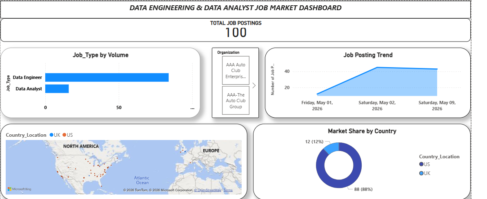
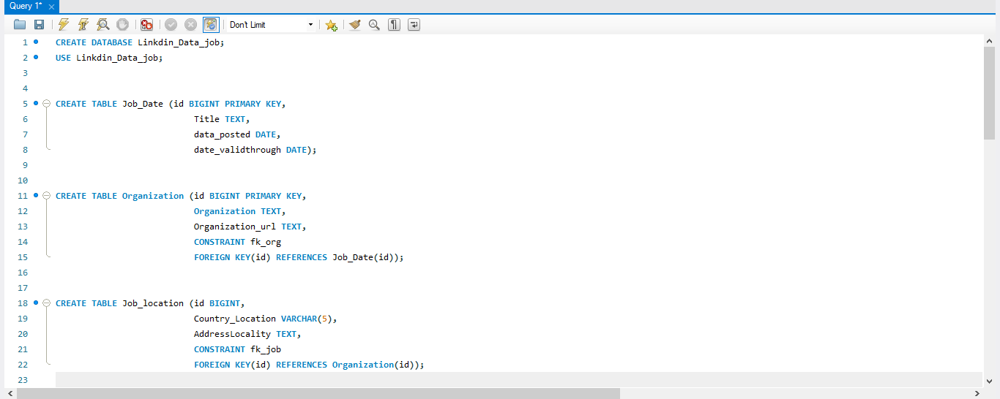
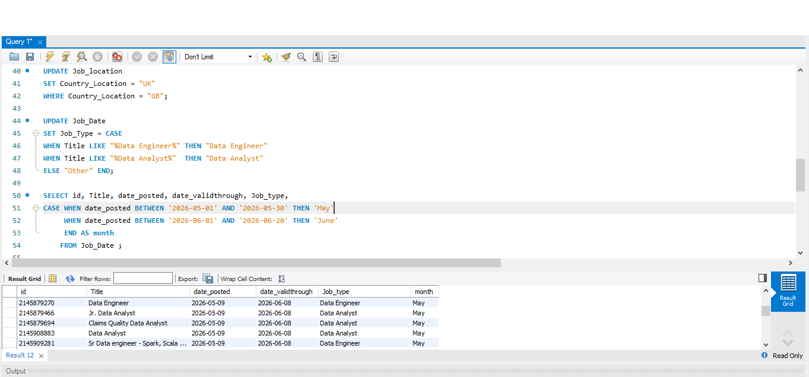
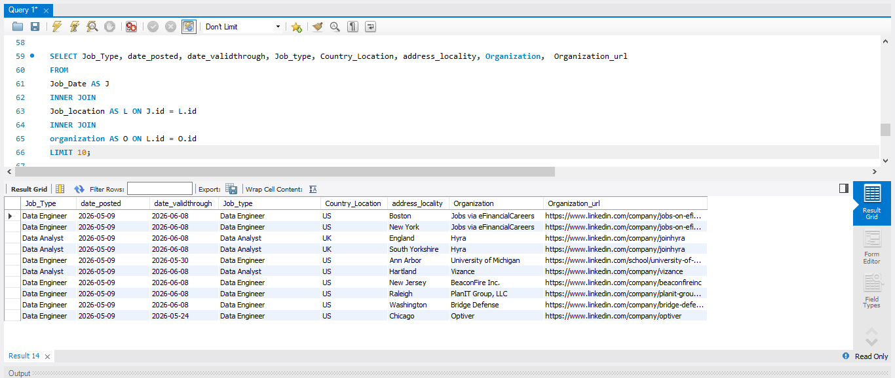
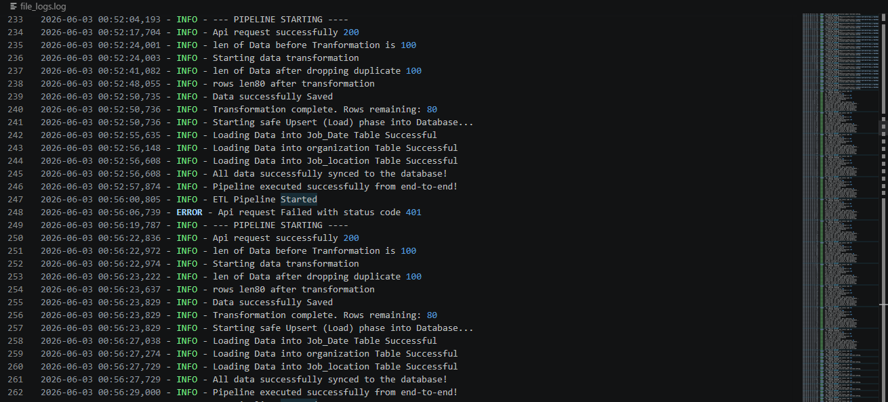

# Job Market ETL Pipeline

## Overview

This project is an automated ETL pipeline that extracts job market data from an API, transforms and cleans the data, loads it into a MySQL database, and visualizes hiring trends using Power BI.

## Technologies Used

* Python
* Pandas
* MySQL
* Power BI
* REST APIs
* Windows Task Scheduler
* Logging
* Git & GitHub

---

## Dashboard Preview

### Hiring Trends Dashboard

The dashboard provides insights into:

* Total Job Postings
* Job Type Distribution
* Hiring Trends Over Time
* Organization Analysis
* Geographic Distribution of Jobs
* Market Share by Country

---

## Database Schema

The database was designed using a normalized structure consisting of:

* Job_Data
* Organization
* Job_Location

Primary and foreign keys were used to maintain data integrity and prevent duplicate records.

---

## Data Transformation

Transformation tasks performed include:

* Creating a new column
* Data manipulation with SQL

---

## Data Joining Process

Multiple tables were combined in the database.

---

## Logging and Monitoring

Logging was implemented to:

* Track pipeline execution
* Monitor data loading operations
* Capture and troubleshoot errors
* Improve pipeline reliability

---

## Automation

The ETL pipeline is scheduled using Windows Task Scheduler and runs every 5 minutes to keep the database updated automatically.

---

## Key Features

* Automated API Data Extraction
* Data Cleaning and Transformation
* Duplicate Prevention Using Primary Keys
* Relational Database Design
* Automated Scheduling
* Logging and Error Handling
* Power BI Dashboard Integration

---

## Future Improvements

* PostgreSQL Integration
* Docker Containerization
* Apache Airflow Orchestration
* Cloud Deployment
* CI/CD with GitHub Actions

---

## Author

**Rabiu Abdulgafar Eniola**

Aspiring Data Engineer | Python | SQL | ETL | Power BI